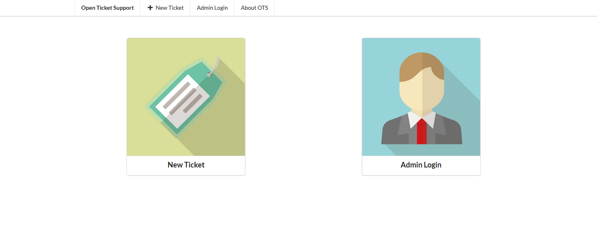

# OpenTicketSupport
Open Source Ticket Support System written in Go

## Functions
- Create Ticket
- List all Tickets
- Download the system database in CSV
- Admin Login with token

## Requirement
The following golang library is required. Run the following commands if you havn't install them.
```
go get -u "github.com/boltdb/bolt"
go get -u "github.com/grokify/html-strip-tags-go"
go get -u "github.com/nu7hatch/gouuid"
go get -u "github.com/gorilla/sessions"

```

## Installation 
To build the system, run ```go build``` inside the "openTicketSupport" folder.
Next, run the compiled binary using ```./openTicketSupport -token very_secure_admin_login_token```
in which the "very_secure_admin_login_token" is the token that admin use to login to the system admin panel.

## Screenshots




## License
MIT License
